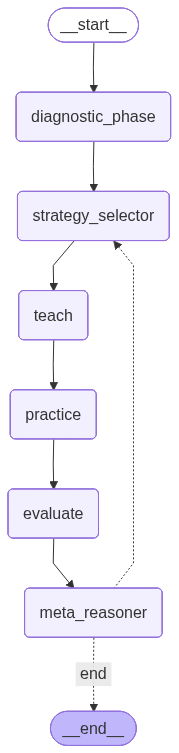
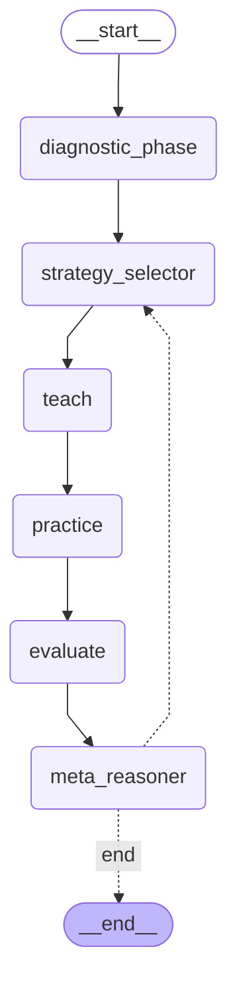

# TeachAgent: Adaptive Learning System

An intelligent, adaptive teaching agent built with LangGraph that personalizes learning experiences through dynamic strategy selection, continuous assessment, and meta-reasoning.

## 🎯 Overview

TeachAgent is an AI-powered educational system that adapts its teaching approach based on student performance. It uses a sophisticated workflow to diagnose student knowledge, select optimal teaching strategies, deliver personalized content, and make intelligent decisions about when to continue, adjust, or conclude learning sessions.

## ✨ Features

- **Adaptive Diagnostics**: Assesses student knowledge level through intelligent questioning
- **Multi-Strategy Teaching**: Employs 5 different teaching strategies:
  - Direct Explanation
  - Socratic Method
  - Worked Examples
  - Analogies
  - Visual Representations
- **Dynamic Strategy Selection**: Chooses the most effective strategy based on student performance and historical effectiveness
- **Continuous Evaluation**: Monitors learning progress after each session
- **Meta-Reasoning**: Makes intelligent decisions about continuing, adjusting, or ending sessions
- **Effectiveness Tracking**: Learns which strategies work best for different topics and student levels

## 🏗️ Architecture

TeachAgent uses **LangGraph** to orchestrate a multi-stage teaching workflow. The system follows a structured pipeline that adapts based on student performance and learning outcomes.

### Workflow Graph

The complete teaching workflow is visualized below:



<details>
<summary>View Mermaid Diagram Source</summary>


</details>

### Workflow Stages

1. **Diagnostic Phase** 🩺
   - Assesses student's current knowledge level
   - Asks adaptive questions until confidence threshold is reached
   - Estimates initial proficiency level

2. **Strategy Selector** 🎯
   - Analyzes available teaching strategies
   - Considers historical effectiveness and student characteristics
   - Selects the optimal strategy for the current context

3. **Teach** 📚
   - Generates personalized teaching content using the selected strategy
   - Adapts explanation style, examples, and difficulty to student level
   - Provides structured learning materials

4. **Practice** 💪
   - Creates practice questions based on the teaching content
   - Adjusts difficulty to match student proficiency
   - Provides opportunities for active learning

5. **Evaluate** 📊
   - Assesses student performance on practice questions
   - Calculates proficiency gains
   - Updates strategy effectiveness metrics

6. **Meta-Reasoner** 🧠
   - Analyzes overall learning progress
   - Considers multiple factors: proficiency, attempts, failures, trends
   - Makes intelligent decisions:
     - **Continue**: Keep teaching with adjusted strategy
     - **End Success**: Learning goal achieved
     - **End Max Attempts**: Maximum attempts reached
     - **End Stuck**: Student appears stuck, needs intervention
     - **Prerequisite**: Identifies missing prerequisite knowledge

The workflow loops back to **Strategy Selector** if continuing, or ends if the goal is achieved or other termination conditions are met.

## 🚀 Installation

### Prerequisites

- Python 3.12 or higher
- `uv` package manager

### Setup

1. **Clone the repository**:
   ```bash
   git clone https://github.com/vishalj0501/teachagent
   cd teachagent
   ```

2. **Install dependencies**:
   ```bash
   uv sync
   ```

3. **Set up environment variables**:
   
   Copy the sample environment file and add your API key:
   ```bash
   cp .env.sample .env
   ```
   
   Then edit `.env` and add your API key:
   ```bash
   GOOGLE_API_KEY=your_google_api_key_here
   ```

## 📖 Usage

### Basic Usage

Run the main script:

```bash
python main.py
```

The system will prompt you to enter a topic to learn (e.g., "binary search", "Bayes theorem"). It will then:

1. Diagnose your current knowledge level
2. Select an appropriate teaching strategy
3. Deliver personalized content
4. Provide practice questions
5. Evaluate your progress
6. Continue or conclude based on your performance

### Example Session

```
Enter a topic to learn: binary search

Learning Goal: Master binary search
Target Proficiency: 0.6
Max Attempts: 10

Starting LangGraph Workflow
============================================================

[Diagnostic Phase]
Running diagnostic assessment...
Questions asked: 3
Confidence: 0.85
Estimated Level: 0.35

[Strategy Selection]
Selected: worked_example

[Teaching]
Generating teaching content...

[Practice]
Creating practice questions...

[Evaluation]
Session Score: 0.72
Proficiency Gain: +0.07

[Meta-Reasoner]
Decision: continue

... (continues until goal achieved or max attempts)
```

## 📁 Project Structure

```
teachagent/
├── agents/                  # Core agent nodes
│   ├── diagnostic.py       # Diagnostic assessment logic
│   ├── strategy_selector.py # Strategy selection logic
│   ├── teach_node.py       # Teaching content generation
│   ├── practice_node.py    # Practice question generation
│   ├── evaluate_node.py    # Performance evaluation
│   ├── meta_reasoner_node.py # Meta-reasoning and decision making
│   └── strategies.py        # Teaching strategy definitions
├── config/                  # Configuration and prompts
│   ├── prompts.py          # LLM prompts for each stage
│   └── parsers.py          # Response parsing utilities
├── core/                    # Core system components
│   ├── graph.py            # LangGraph workflow definition
│   └── state.py            # State management and types
├── tools/                   # Utility tools
│   └── llm.py              # LLM interface and configuration
├── utils/                   # Helper utilities
│   └── log_utils.py        # Logging utilities
├── main.py                  # Entry point
└── README.md               # This file
```

## 🔧 Key Components

### State Management

The system uses a comprehensive `AgentState` that tracks:
- Student proficiency and diagnostic results
- Current teaching strategy and available strategies
- Learning sessions and history
- Meta-reasoning state (stuck counter, prerequisites)
- Control flow (next action, goal status, attempts)

### Teaching Strategies

Each strategy is designed for different learning styles:

- **Direct Explanation**: Clear, structured explanations for analytical learners
- **Socratic Method**: Guided discovery through questions
- **Worked Examples**: Step-by-step problem solving demonstrations
- **Analogies**: Relating concepts to familiar ideas
- **Visual Representations**: Diagrams, charts, and visual explanations

### Adaptive Learning

The system continuously adapts by:
- Tracking strategy effectiveness across sessions
- Adjusting difficulty based on performance
- Identifying when students are stuck
- Recommending prerequisite topics when needed
- Optimizing strategy selection over time


## 📊 Output

The system generates:
- **Session summaries**: Detailed logs of each learning session
- **Strategy performance**: Effectiveness metrics for each teaching strategy
- **Decision logs**: Audit trail of agent decisions
- **Effectiveness data**: Exported CSV files tracking strategy performance

